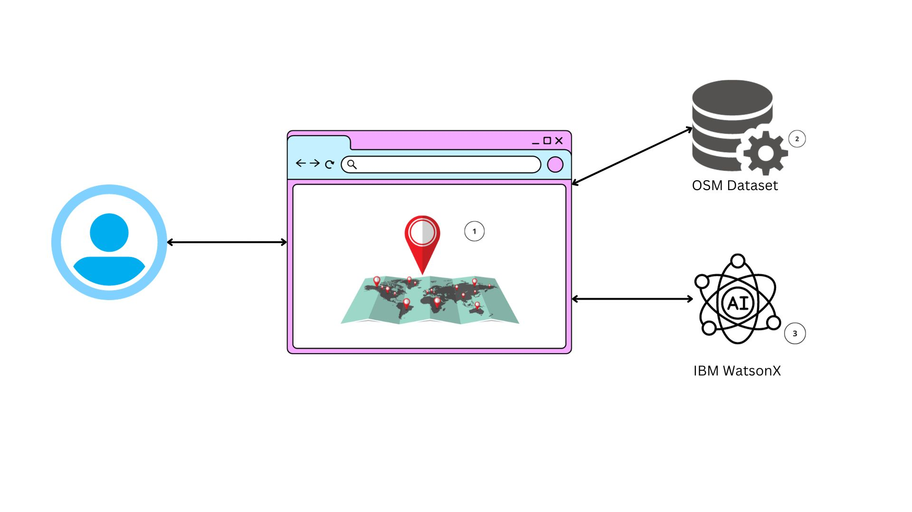

# DumpWarriors

- [Project summary](#project-summary)
  - [The issue we are hoping to solve](#the-issue-we-are-hoping-to-solve)
  - [How our technology solution can help](#how-our-technology-solution-can-help)
  - [Our idea](#our-idea)
- [Technology implementation](#technology-implementation)
  - [IBM AI service(s) used](#ibm-ai-services-used)
  - [Other IBM technology used](#other-ibm-technology-used)
  - [Solution architecture](#solution-architecture)
- [Presentation materials](#presentation-materials)
  - [Solution demo video](#solution-demo-video)
  - [Project development roadmap](#project-development-roadmap)
- [Additional details](#additional-details)
  - [How to run the project](#how-to-run-the-project)
  - [Live demo](#live-demo)
- [About this template](#about-this-template)
  - [Contributing](#contributing)
  - [Versioning](#versioning)
  - [Authors](#authors)
  - [License](#license)
  - [Acknowledgments](#acknowledgments)

_INSTRUCTIONS: Complete all required deliverable sections below._

## Project summary

### The issue we are hoping to solve

Annually, waste production surges, with illegal dumpsites proliferating, especially in unaddressed locations. Inadequate recycling exacerbates ecological and health issues, as dumpsites attract disease-carrying pests. This leads to potentially life-threatening diseases, while also impacting the mental well-being of communities residing near these sites.

### How our technology solution can help

Mapping, monitoring and preventing potential illegal dumpsites using Machine Learning

### Our idea

INSTRUCTIONS: Replace this paragraph with a longer description of your solution. In about 500 words, describe your solution in more detail. Include the real-world problem you identified, describe the technological solution you have created, and explain how it’s an improvement over existing solutions. You can supply additional documentation in this source code repository that you link to as well.

More detail is available in our [description document](./docs/DESCRIPTION.md).

## Technology implementation

### IBM AI service(s) used

_INSTRUCTIONS: Included here is a list of commonly used IBM AI services. Remove any services you did not use, or add others from the linked catalog not already listed here. Leave only those included in your solution code. Provide details on where and how you used each IBM AI service to help judges review your implementation. Remove these instructions._

- [IBM Natural Language Understanding](https://cloud.ibm.com/catalog/services/natural-language-understanding) - WHERE AND HOW THIS IS USED IN OUR SOLUTION
- [Watson Assistant](https://cloud.ibm.com/catalog/services/watson-assistant) - WHERE AND HOW THIS IS USED IN OUR SOLUTION
- [Watson Discovery](https://cloud.ibm.com/catalog/services/watson-discovery) - WHERE AND HOW THIS IS USED IN OUR SOLUTION
- [Watson Speech to Text](https://cloud.ibm.com/catalog/services/speech-to-text) - WHERE AND HOW THIS IS USED IN OUR SOLUTION
- [Watson Text to Speech](https://cloud.ibm.com/catalog/services/text-to-speech) - WHERE AND HOW THIS IS USED IN OUR SOLUTION
- List any additional [IBM AI services](https://cloud.ibm.com/catalog?category=ai#services) used or remove this line

### Other IBM technology used

INSTRUCTIONS: List any other IBM technology used in your solution and describe how each component was used. If you can provide links to/details on exactly where these were used in your code, that would help the judges review your submission.

### Solution architecture

Diagram and step-by-step description of the flow of our solution:

1. A user-facing application is created, where users input a location to identify potential illegal dump sites.
2. Geopy and OpenStreetMap are used for translating user's input into geographical coordinates and render map
3. Next, the coordinates obtained through Geopy and the OSM data are transmitted to IBMs Watson Machine Learning model — WatsonX built on the CatBoost algorithm. This model is trained to assess the provided coordinates and predict whether the location is a potential illegal dump site based on its geospatial characteristics.
4. If the location is marked in red on the map, it suggests the presence of a potential illegal dumping site. Conversely, if the location appears in green, it indicates that the area is likely free from such concerns.

## Presentation materials

_INSTRUCTIONS: The following deliverables should be officially posted to your My Team > Submissions section of the [Call for Code Global Challenge resources site](https://cfc-prod.skillsnetwork.site/), but you can also include them here for completeness. Replace the examples seen here with your own deliverable links._

### Solution demo video

### Project development roadmap

The project currently focuses on the development of a minimal viable product (MVP) that possesses the capability to identify illegal dumpsites through visual mapping. This will serve as a foundation for the application's functionality and purpose.

- Feature 1
- Feature 2
- Feature 3

In the future we plan to iteratively enhance our application 

Product Iteration Phase 2 - Building a robust reporting mechanism. This system will enable users to effectively report instances of illegal dumpsites they encounter, promoting community involvement and action in addressing environmental concerns.

Product Iteration Phase 3 - Enhance the application's overall utility. We will achieve this by incorporating information about legal dumpsites onto our maps. This additional data will provide users with a comprehensive view of disposal options and further support responsible waste management practices.

Product Iteration Phase 4 - EcoEye will take a significant step towards discouraging illegal dumping. We will deploy a comprehensive disincentive system that incorporates advanced surveillance cameras, sensors, and alarming mechanisms. This system will not only help in the identification of illegal dumpers but also serve as a deterrent, promoting responsible waste disposal practices and protecting our environment.

## Additional details

_INSTRUCTIONS: The following deliverables are suggested, but **optional**. Additional details like this can help the judges better review your solution. Remove any sections you are not using._

### How to run the project

INSTRUCTIONS: In this section you add the instructions to run your project on your local machine for development and testing purposes. You can also add instructions on how to deploy the project in production.

### Live demo

You can find a running system to test at...

See our [description document](./docs/DESCRIPTION.md) for log in credentials.

---

_INSTRUCTIONS: You can remove the below section from your specific project README._

## About this template

### Contributing

Please read [CONTRIBUTING.md](CONTRIBUTING.md) for details on our code of conduct, and the process for submitting pull requests to us.

### Versioning

We use [SemVer](http://semver.org/) for versioning. For the versions available, see the [tags on this repository](https://github.com/your/project/tags).

### Authors

- **Billie Thompson** - _Initial work_ - [PurpleBooth](https://github.com/PurpleBooth)

### License

This project is licensed under the Apache 2 License - see the [LICENSE](LICENSE) file for details.

### Acknowledgments

- Based on [Billie Thompson's README template](https://gist.github.com/PurpleBooth/109311bb0361f32d87a2).
